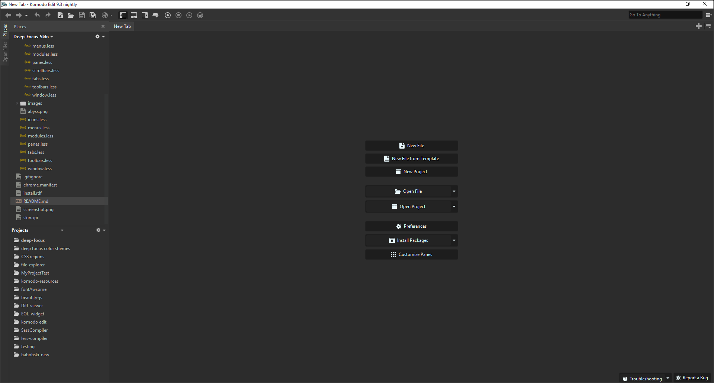

# Deep-Focus-Skin
A dark skin for Komodo edit/ide, build on the abyss skin.

Its a bit lighter than the abyss skin but still a dark skin.  
This color pallet is lighten up a bit, flatten the ui, and the icon set is now light (white).

Created this for less contrast, used the abyss skin before but the skin was just a bit to dark for me.
The contrast between the code and the background was to hard, so i create a lighter dark theme, so i could dim the background color of my color schemes and have more focus.

## Color schemes
Converted a few color schemes for the Deep focus skin.
* Dracula
* Monokai
* Monokai purple
* Soda dark
* Flasty

They can be found [here](https://github.com/babobski/Deep-focus-color-schemes).

## Screenshot

